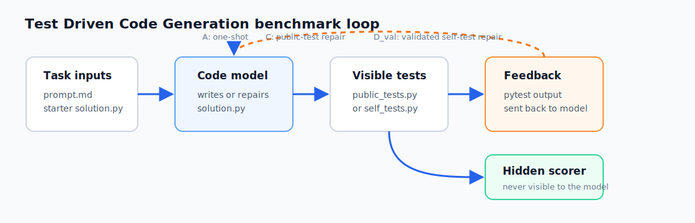
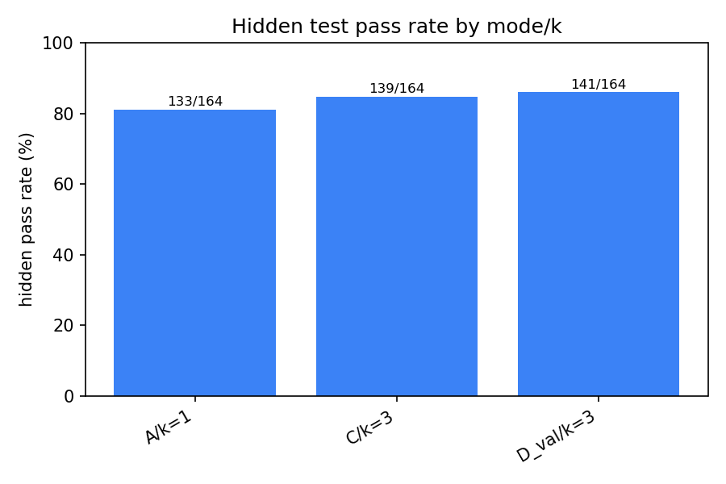
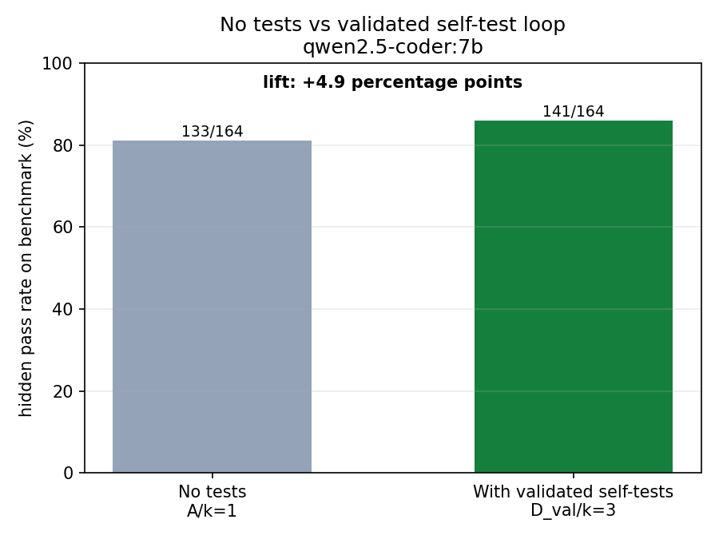
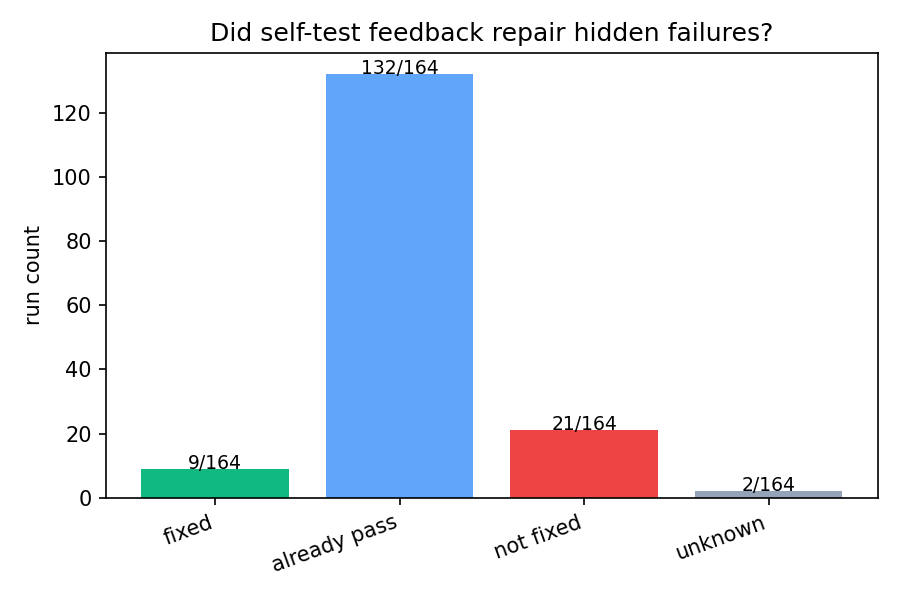
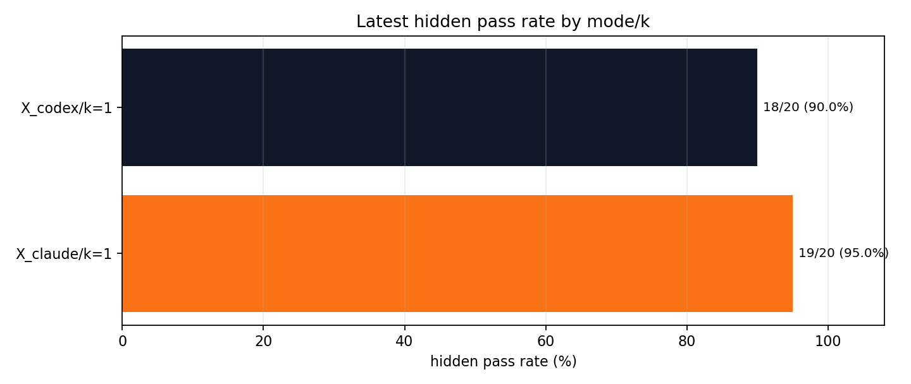

# TDCG - Test Driven Code Generation
## Coding Hypothesis — Test-Repair Loop Ablation

Hypothesis: small coding models become much more effective when wrapped in a
test-execution-repair loop. We measure how much of agentic coding performance
comes from execution feedback vs raw one-shot model intelligence.

## How it works



The model only sees the task prompt, starter code, and visible test feedback.
Hidden tests are scored later in an isolated directory, so the benchmark can
measure whether visible feedback actually improves generalization.

## Modes
| Mode | Tests              | Execution | Measures                          |
|------|--------------------|-----------|-----------------------------------|
| A    | none               | no        | raw codegen                       |
| B    | model-written      | no        | "test thinking" alone             |
| C    | public (reliable)  | yes       | feedback use with reliable tests  |
| D    | model-written      | yes       | full self-loop (the hypothesis)   |
| D_sep| model-written      | yes       | solution first, tests second      |
| D_dual | model-written    | yes       | code model + test model           |
| D_val | validated model-written | yes   | code model + test model + validator + optional reference oracle |
| E    | public + model     | yes       | practical ceiling                 |

A and B run with `k=1` (no iteration). C/D/D_sep/D_dual/D_val/E iterate up to `k`.

## Key decomposition
```
C - A = execution-feedback value (with reliable tests)
D - A = self-loop value
D_sep - A = separated self-loop value
D_dual - A = two-model self-loop value
D_val - A = validated self-loop value
C - D = test-writing weakness
D_val - D_dual = test-validation value
E - C = marginal value of model-written tests on top of public
```

## Result snapshot

HumanEval+ full run, `qwen2.5-coder:7b`, batch `humaneval_plus_full_v3`.
The headline comparison is one-shot code generation versus public-test repair
and validated self-test repair.





The repair trace is the guardrail: it separates real hidden-failure repairs
from solutions that already passed before self-test feedback.



## Layout
```
tasks/
  task_001_sum_evens/
    prompt.md           # spec shown to the model
    solution.py         # starter the model edits
    public_tests.py     # visible feedback (modes C, E)
    hidden_tests.py     # final scoring only — never enters the sandbox
    reference_solution.py # optional trusted oracle for validating self_tests.py
  ...
harness/
  sandbox.py            # tempdir + subprocess pytest
  models.py             # Ollama client
  agent.py              # per-mode prompts + iteration loop
  external_agents.py    # Codex/Claude Code CLI benchmark bridge
  log.py                # JSONL records
  plot.py               # matplotlib plots from JSONL
run.py                  # CLI
results/
  runs.jsonl            # one line per run (appended forever)
  plots/<batch_tag>/    # auto-saved plots per run-batch
```

## Plots per batch
Every `run.py` invocation tags rows with `batch_tag` (default = timestamp) and
saves PNGs to `results/plots/<batch_tag>/`:

- `pass_rate_by_mode_k.png` — bar chart, hidden pass rate per (mode, k)
- `failure_count_by_mode.png` — hidden pass/fail/timeout/unscored counts
- `repair_outcomes.png` — when `--score-hidden-each-iter` is enabled, counts hidden-fail→hidden-pass repairs
- `self_test_confusion_by_mode.png` — self-test signal vs hidden outcome
- `overfit_rate_by_mode.png` — visible pass + hidden fail (kill metric)
- `tokens_vs_pass.png` — compute spent vs outcome
- `remaining_failures_heatmap.png` — unresolved tasks across the main modes
- `rerun_gain_by_mode.png` — first-vs-latest row gains in append-only logs
- `pass_rate_vs_iterations.png` — only when a complete comparable k-sweep exists
- `delta_by_model_size.png` — only when JSONL has ≥2 models
- `summary.json` — counts + filter info
- `ablation_summary.json` — paired A-vs-test outcomes plus self-test/hidden confusion matrix

Regenerate anytime: `python -m harness.plot --batch-tag <tag>`
Across all batches: `python -m harness.plot --out results/plots/all`
Skip auto-plot: `--no-plot`

## External coding-agent baselines

Use `harness.external_agents` to benchmark Codex CLI and Claude Code through
Ollama on the same tasks and hidden scorer. The agent sees only `prompt.md`,
`public_tests.py`, `solution.py`, `AGENTS.md`, and `CLAUDE.md`; hidden tests are
scored after the agent exits.

Example best-effort external-agent baseline on a 20-task HumanEval+ slice:



Install/configure the external tools first:

```bash
npm install -g @openai/codex
curl -fsSL https://claude.ai/install.sh | bash
ollama pull qwen2.5-coder:7b
```

Smoke-test one task:

```bash
python -m harness.external_agents \
  --model qwen2.5-coder:7b \
  --agents codex,claude \
  --benchmark humaneval_plus \
  --limit 1 \
  --jobs 1 \
  --agent-timeout 600 \
  --hidden-timeout 600 \
  --save-artifacts \
  --log results/humaneval_plus_external_agents_smoke.jsonl \
  --batch-tag humaneval_plus_external_agents_smoke
```

Benchmark every local Ollama model against both external agents:

```bash
python -m harness.external_agents \
  --models-from-ollama \
  --agents codex,claude \
  --benchmark humaneval_plus \
  --limit 20 \
  --jobs 1 \
  --agent-timeout 600 \
  --hidden-timeout 600 \
  --save-artifacts \
  --log results/humaneval_plus_external_agents_all_models_v1.jsonl \
  --batch-tag humaneval_plus_external_agents_all_models_v1
```

Use `--models model_a,model_b` when you want an explicit subset. Keep
`--jobs 1` for local Ollama comparisons unless you have enough separate model
serving capacity; high concurrency turns agent quality into queueing noise.

You can also append external-agent baselines directly from `run.py` with
`--agents codex,claude`. In that integrated mode, `--jobs` controls the native
harness modes and `--agent-jobs` controls Codex/Claude cases separately
(`--agent-jobs` defaults to 1 for local Ollama stability).

Run a surgical hard-task comparison:

```bash
python -m harness.external_agents \
  --model qwen2.5-coder:7b \
  --agents codex,claude \
  --tasks \
    tasks_bench/humaneval_plus/HumanEval_32 \
    tasks_bench/humaneval_plus/HumanEval_86 \
    tasks_bench/humaneval_plus/HumanEval_91 \
    tasks_bench/humaneval_plus/HumanEval_115 \
    tasks_bench/humaneval_plus/HumanEval_124 \
    tasks_bench/humaneval_plus/HumanEval_130 \
    tasks_bench/humaneval_plus/HumanEval_132 \
    tasks_bench/humaneval_plus/HumanEval_142 \
    tasks_bench/humaneval_plus/HumanEval_145 \
    tasks_bench/humaneval_plus/HumanEval_146 \
    tasks_bench/humaneval_plus/HumanEval_147 \
    tasks_bench/humaneval_plus/HumanEval_158 \
    tasks_bench/humaneval_plus/HumanEval_159 \
    tasks_bench/humaneval_plus/HumanEval_163 \
  --jobs 1 \
  --agent-timeout 600 \
  --hidden-timeout 600 \
  --save-artifacts \
  --log results/humaneval_plus_external_agents_hard14.jsonl \
  --batch-tag humaneval_plus_external_agents_hard14
```

By default Codex uses direct `codex exec --oss --local-provider ollama`, while
Claude Code uses `ollama launch claude`. You can switch Codex to Ollama's
launcher with `--codex-command ollama-launch` or switch Claude to direct CLI
invocation with `--claude-command direct`.

Local OSS models do not always drive the Codex/Claude editing tools correctly.
For that case, the runner accepts a final fenced Python block from stdout and
writes it to `solution.py`, recording `stdout_code_fallback_used=true`. Add
`--no-stdout-code-fallback` for a stricter pure tool-use comparison. If strict
mode leaves `solution.py` untouched, the run is reported as `agent_no_edit`;
that measures tool-use compatibility, not Python problem-solving ability.

## Quick start

```bash
# 1. start Ollama and pull the model
ollama pull qwen2.5-coder:1.5b

# 2. dry-run wiring without any model calls
python run.py --model qwen2.5-coder:1.5b --all --modes A,C --ks 1,3,5 --dry-run

# 3. real pilot: Qwen-1.5B, modes A + C, k=1,3,5, all 3 tasks (= 12 runs)
python run.py --model qwen2.5-coder:1.5b --all --modes A,C --ks 1,3,5

# 4. inspect
cat results/runs.jsonl
```

## Official benchmarks

Don't use plain HumanEval/MBPP for main proof — contamination + weak tests. Use
the stack below (phase 1 supported by current harness; phase 2 needs repo-level
extensions).

| Benchmark | Use for | Loader |
|-----------|---------|--------|
| **HumanEval / MBPP** | Sanity check only | `humaneval`, `mbpp`, `mbpp_san` |
| **EvalPlus HumanEval+ / MBPP+** | First real eval (80x / 35x stronger tests) | `humaneval_plus`, `mbpp_plus` |
| **LiveCodeBench** | Contamination-resistant main bench (time-window) | `livecodebench` |
| **BigCodeBench-Hard** | Realistic function/library-use (148 hard tasks) | `bigcodebench_hard` |
| BigCodeBench full | 1140 tasks | `bigcodebench` |
| SWE-bench Pro Public | Repo-level (731 tasks) | `swebench_pro` |
| SWE-bench-Live | Monthly fresh repo-level | `swebench_live_lite` / `_verified` / `_full` |
| SWT-Bench | Test-generation on real bugs | `swtbench_lite` / `swtbench_verified` |
| Terminal-Bench | Shell tool-use control (80 tasks) | `terminal_bench` |

### Materialize + run

```bash
# EvalPlus
python -m harness.load_benchmark --name humaneval_plus
python run.py --model qwen2.5-coder:1.5b --benchmark humaneval_plus --modes A,C --ks 1,3,5 --limit 50

# Self-test ablation with repeated seeds.
# At temperature 0, repeated seeds may produce identical candidates; use a small
# positive temperature when you want seed-to-seed variation.
python run.py \
  --model qwen2.5-coder:7b \
  --test-model qwen2.5-coder:7b \
  --validator-model gemma4:e2b \
  --benchmark humaneval_plus \
  --modes A,D,D_sep,D_dual,D_val \
  --ks 1,3,5 \
  --limit 164 \
  --hidden-timeout 120 \
  --score-hidden-each-iter \
  --temperature 0.2 \
  --seeds 1,2,3,4,5 \
  --batch-tag humaneval_plus_repair_qwen7b_full

# Two-model self-test agent only:
# code model writes and repairs solution.py; test model writes frozen self_tests.py.
python run.py \
  --model qwen2.5-coder:7b \
  --test-model qwen2.5-coder:7b \
  --benchmark humaneval_plus \
  --modes A,D_dual \
  --ks 1,3 \
  --limit 20 \
  --hidden-timeout 120 \
  --score-hidden-each-iter \
  --batch-tag humaneval_plus_dual_qwen7b_test7b_20

# Validated self-test agent:
# code model writes/repairs solution.py; test model writes self_tests.py;
# validator model rejects weak or invalid tests before execution.
# If reference_solution.py exists, D_val also runs self_tests.py against it
# and rejects tests with wrong expected values.
python run.py \
  --model qwen2.5-coder:7b \
  --test-model qwen2.5-coder:7b \
  --validator-model gemma4:e2b \
  --benchmark humaneval_plus \
  --modes A,D_val \
  --ks 1,3 \
  --limit 20 \
  --hidden-timeout 120 \
  --score-hidden-each-iter \
  --batch-tag humaneval_plus_validated_qwen7b_test7b_gemma_validator_20

# Longer full-validation runs can parallelize independent cases and raise the
# Ollama HTTP timeout separately from pytest hidden-test timeout.
python run.py \
  --model qwen2.5-coder:7b \
  --test-model qwen2.5-coder:7b \
  --validator-model gemma4:e2b \
  --repair-model gemma4:e2b \
  --benchmark humaneval_plus \
  --modes A,C,D_val \
  --ks 3 \
  --hidden-timeout 360 \
  --model-timeout 600 \
  --repair-model-timeout 240 \
  --jobs 8 \
  --score-hidden-each-iter \
  --save-artifacts \
  --self-test-candidates 3 \
  --code-candidates 2 \
  --repair-candidates 3 \
  --max-bash-calls 40 \
  --log results/humaneval_plus_full_v3.jsonl \
  --batch-tag humaneval_plus_full_v3 \
  --resume

# If you change timeouts, prompts, candidates, or repair behavior, keep the same
# append-only log but rerun stale failures instead of letting --resume skip them:
# add --rerun-failed. Plots and summaries deduplicate by task/mode/k/seed and
# keep the latest row for each run key.

# Cheaper D_val profile for cost/timeout-control experiments. This keeps the
# same A/C/D_val comparison shape but uses one self-test suite, one code
# candidate, one repair candidate, max 12 bash calls, and 180s repair timeout.
python run.py \
  --model qwen2.5-coder:7b \
  --test-model qwen2.5-coder:7b \
  --validator-model gemma4:e2b \
  --repair-model gemma4:e2b \
  --benchmark humaneval_plus \
  --modes A,C,D_val \
  --ks 3 \
  --hidden-timeout 360 \
  --model-timeout 600 \
  --jobs 8 \
  --score-hidden-each-iter \
  --cheap-dval \
  --log results/humaneval_plus_cheap_dval_v1.jsonl \
  --batch-tag humaneval_plus_cheap_dval_v1 \
  --resume

# Portfolio selector: choose between completed C/k=3 and D_val/k=3 artifacts
# using only visible signals, then score the selected solution as P_select.
python -m harness.portfolio_select \
  --log results/humaneval_plus_full_v3.jsonl \
  --batch-tag humaneval_plus_full_v3 \
  --out-log results/humaneval_plus_full_v3_portfolio.jsonl \
  --out-batch-tag humaneval_plus_full_v3_portfolio \
  --benchmark humaneval_plus \
  --score-policy rescore \
  --hidden-timeout 360 \
  --save-artifacts \
  --resume

# LiveCodeBench — pick problems after the model's likely training cutoff
python -m harness.load_benchmark --name livecodebench --since 2024-06-01 --difficulty easy --limit 50
python run.py --model qwen2.5-coder:1.5b --benchmark livecodebench --modes A,C --ks 1,3,5

# BigCodeBench-Hard
python -m harness.load_benchmark --name bigcodebench_hard
python run.py --model qwen2.5-coder:1.5b --benchmark bigcodebench_hard --modes A,C --ks 1,3,5 --limit 30
```

### Verify materialized benchmark

After materializing, run the canonical solutions through public + hidden tests
to confirm the loader produced a correct harness:

```bash
python -m harness.smoke_bench --name humaneval_plus --limit 20 --timeout 60
python -m harness.smoke_bench --name mbpp_plus     --limit 20 --timeout 60
```

(LiveCodeBench does not ship canonical solutions; the loader writes a starter
and pipes test inputs via subprocess.)

## Phase 2: repo-level + shell benchmarks (Docker required)

These benchmarks operate on real repositories or shell sessions. The current
Python pytest sandbox is not sufficient; execution uses Docker (and tmux for
Terminal-Bench). Loaders are implemented; the diff-generating agent + scoring
wrapper are next.

### Sanity: Docker primitive

```bash
python -c "from harness.docker_sandbox import DockerSandbox, ensure_image; \
  ensure_image('alpine:3'); sb = DockerSandbox(image='alpine:3'); \
  r = sb.run(['sh','-c','echo hello']); print(r.returncode, r.stdout); sb.cleanup()"
```

### Materialize SWE-bench / SWT-Bench instances

```bash
# SWE-bench Pro Public (731 tasks)
python -m harness.load_swebench --variant swebench_pro --limit 50

# SWE-bench-Live lite (300 monthly-fresh tasks)
python -m harness.load_swebench --variant swebench_live_lite

# SWT-Bench Lite (300 instances — same SWE-bench Lite repo space)
python -m harness.load_swebench --variant swtbench_lite
```

Each instance becomes a directory with `prompt.md`, `instance.json`, `gold.diff`.
Aggregated `instances.jsonl` is written to the variant root.

### Materialize Terminal-Bench

```bash
python -m harness.load_tbench --limit 20
```

Writes thin pointer dirs (`tbench_path.txt`) into `tasks_bench/terminal_bench/`.
Source assets stay in the official `terminal-bench-core` cache.

### Repo-level D_val_agent runner

`D_val_agent` is the repo-level extension of the validated loop. It copies a
real repository into an isolated workspace, builds a bounded repo map, asks for
a multi-step plan, reads selected files, applies multi-file edits, runs visible
verification commands, reviews the resulting diff, and writes PR-style
artifacts.

```bash
python -m harness.repo_agent \
  --task tasks_bench/swebench_pro/<instance_id> \
  --repo /path/to/repo-at-base-commit \
  --model qwen2.5-coder:7b \
  --validator-model gemma4:e2b \
  --review-model gemma4:e2b \
  --verify "python -m pytest" \
  --max-iterations 3 \
  --command-timeout 180 \
  --log results/repo_agent_runs.jsonl \
  --batch-tag repo_agent_smoke
```

Task directories may also provide:

- `prompt.md` — the task/request.
- `repo_agent.json` — optional `{"verification_commands": [...]}`.
- `checks.sh` — copied into the workspace and runnable as `bash checks.sh`.

Artifacts are written under `results/artifacts/repo_agent/<batch>/<task>/` by
default:

- `repo_map.md` / `repo_map.json` — intelligent repo scan.
- `plan.json` — multi-step plan and selected files.
- `context.md` — files read before editing.
- `verification_iter_*.json` — visible command results.
- `prediction.diff` — final patch.
- `review.md` — code review findings/suggestions.
- `pr.md` — PR-style summary and verification notes.

Use `--dry-run` to validate repository mapping and artifact plumbing without
making model calls.

Verification commands can originate from model output, so by default they run on
the host (trusted tasks/models only). Add `--docker --docker-image ` to run
every verification command inside a container with the workspace mounted and no
network (`--docker-network`, `--docker-platform` to override). The selected
sandbox is recorded per run as `extra.verification_sandbox`.

### Scoring (TODO — wire to official runners)

- SWE-bench / Pro / Live / SWT: invoke
  `python -m swebench.harness.run_evaluation --predictions_path … --dataset_name … --split …`
- Terminal-Bench: invoke `tb run --task <id> --agent <wrapper>`

Official scorer integration is still separate: `D_val_agent` produces
`prediction.diff`; the next milestone is converting those diffs into the
official SWE-bench/Terminal-Bench prediction formats and invoking their runners.

## Budget (locked, equal across modes)
- max iterations: from `--ks`
- max bash calls per run: 20 by default (`--max-bash-calls`)
- visible public/self pytest timeout: 10s (`--pytest-timeout`)
- final hidden benchmark scoring timeout: 60s (`--hidden-timeout`)
- model HTTP request timeout: 120s (`--model-timeout`)
- optional repair-only HTTP timeout: defaults to `--model-timeout`, override with `--repair-model-timeout`
- repair model errors are fail-fast by default and preserve the current solution; use `--continue-repair-after-model-error` to keep trying
- cheap validated profile: `--cheap-dval`
- visible-only portfolio selector: `python -m harness.portfolio_select`
- parallel independent cases: 1 worker (`--jobs`)
- optional per-iteration hidden scoring for repair analysis: `--score-hidden-each-iter` (never shown to the model)
- dual/validated skill files: `agent_skills/code_writer/skills.md`, `agent_skills/test_writer/skills.md`, and `agent_skills/test_validator/skills.md`
- temperature: 0
- model sampling seed: 0 by default (`--seed` or repeated with `--seeds`)
- max output tokens per call: 4096

## Gate
If `C(k=5) - A(k=1) >= 15 percentage points` over the pilot set, expand to
modes D/D_sep/D_dual/D_val + E and scale to more tasks / model sizes.

## Results

HumanEval+ (164 tasks), `qwen2.5-coder:7b`, batch `humaneval_plus_full_v3`:

| Mode      | k | Hidden pass | Pass rate | Δ vs A/k=1 |
|-----------|---|-------------|-----------|------------|
| A         | 1 | 119/164     | 72.56%    | —          |
| C         | 3 | 139/164     | 84.76%    | +12.19 pp  |
| D_val     | 3 | 141/164     | 85.98%    | +13.41 pp  |

See [RESULTS.md](RESULTS.md) for run command and provenance.
